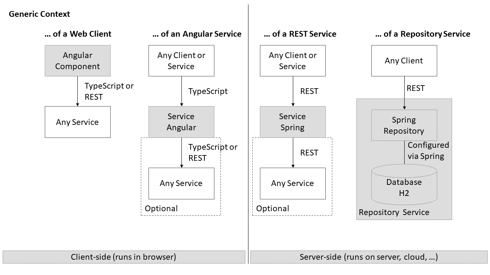
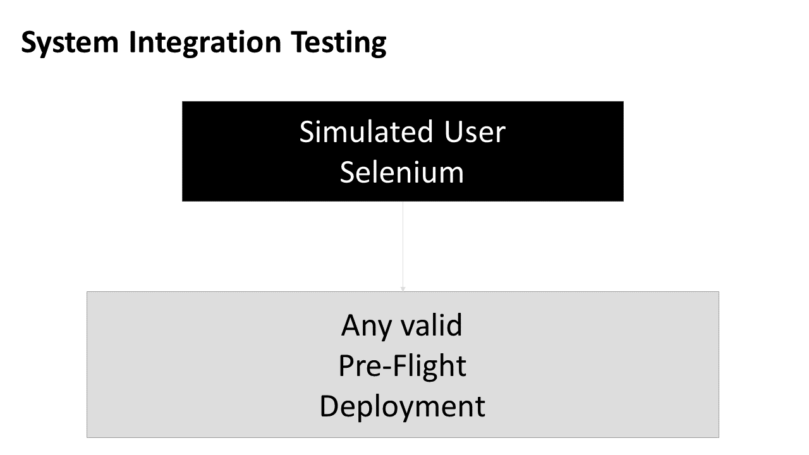

# Pre-Flight Architecture Documentation

## 1. Requirements and Goals

The goal of _pre-flight_ is:

* Open source reference architecture clearly documenting all interfaces between flight planning tools and external services, such as weather providers
* Open source tools that can be used to educate people on the functionality of each one of the tools around the flight planning that have been implemented
* Supporting pilots like me in planning VFR and IFR flights correctly and efficiently in a semi-automated manner

From this, the need to support the following quality goals arises:

* Correctness: Especially critical computations must be 100 % correct. All software will be tested with appropriate testing techniques, tests will also be published along with the software.
* Transparency: All computations will be done in a way that the user sees what is happening. For instance, the exact data sources will be mentioned by the software. This is also complementing the open source character of the software.
* Maintainability, Portability and Extensibility: The software will be designed in a way that parts can be easily exchanged and deployed elsewhere.

At a high level, features of the software will include:

1. Planning a flight route in a semi-automated manner using a paper map considering aircraft performance and the weather along the route
1. Managing printouts of approach plates needed for a flight (esp. IFR)
1. Weight and balance computations for airplanes
1. Computing the take off and landing run
1. Creating a weather briefing
1. Planning a flight route in a semi-automated manner using a list of points considering aircraft performance and the weather along the route
1. Route discovery between airports
1. Generating flight plans for filing

## 2. Constraints and Conventions

* The software must be shippable in a first version by end of 2019, this restricts the project capacity to 12 person days
* All tools included must be non-commercial and non-GPL
* All tools produced by the project must be accessible through a web browser with no installation required by the end users

## 3. System Context

## 4. Solution Strategy

The key drivers behind the strategy behind Pre-Flight are:

* Education - Creating of a clearly documented and understandable reference architecture for flight planning tools
* Business value - Automating the most time-consuming activities in the manual flight planning process
* Easy access - All tools are web-apps that are accessible from any system relying only on a web browser
* Transpacency on actions performed and data used by the software to the user so that errors (e.g. invalid / outdated data) can be easily detected
* Modularization - Leaving extension points for further automation (e.g. easy replacement of initially manual inputs by data from web services)

### 4.1 Technology Strategy

To reduce the variation in technology, the entire architecture of Pre-Flight will be composed only of three types of technical building blocks:

* Web-clients, exposing a UI to the user - those are implemented using [Angular](https://angular.io/start). They consume services (including repository services) for accessing and storing data.
* Services, providing business logic behind a REST interface - those are implemented using [Spring RESTful Services](https://spring.io)
* Repository Services, giving access to a contained database through a REST interface  - those are implemented using [Spring Repository for the H2 database](https://spring.io)

Each building block corresponds to a component in chapter 5. See chapter 8 for details on how each one of those is implemented in detail. For details on why those technologies have been chosen, see chapter 9. 

### 4.2 Test Strategy

Three levels of testing are relevant for the development: 

* Unit testing
* Integration testing of a component
* System testing of a deployable overall product

For unit and component level testing, the following frameworks are used:

* Karma / Jasmine for the WebClient part
* JUnit for the REST interfaces exposed by services

For system level testing, Selenium is used.

The development follows a test-driven approach. This entails that unit tests are created as part of the development process.

For component-level tests, a Mock component is developed in parallel to the counterpart requiring the interface. For example, while developing a web client that requires to use a particular service, the corresponding mock service is developed. The mock services are developed as regular self-contained Spring REST services. The mock clients are developed in JUnit, exploiting the Java interface declaring the REST operation in Spring's code. Mock client and mock service development will be part of the development process of the interfaces.

For system-level tests, Selenium tests are created, one for each use case. This can be started as early as the UI for a use cases is defined, and before the respective business logic is in place.

### 4.3 Delivery and Deployment Strategy

The project structure and the delivery pipeline is shown below for an example application containing web clients and services.

Generally, the build process first builds the integration test environment, containing of all mock services needed for testing. The integration test environment is immediately fired up. This way, the services from the test environment can be accessed during the testing phase of the web clients and the services. After this, the web clients are tested and built into HTML, CSS and JavaScript. These artifacts are immediately integrated into the main application project, which is built last. The build output is a deployable JAR file containing the web ui, production services, embedded Tomcat and the embedded database.

After the production artifact is available, the integration test environment is stopped and the production environment is started. The final build step comprises running the system tests against the production environment.

The build is designed as a Maven build, so that it can be easily triggered from Eclipse and from a CI pipeline.

## 5. System Decomposition View

### 5.1 Flight Planner

### 5.2 Approach Plate Manager

### 5.3 Aircraft Manager

## 6. Runtime View

TODO Navigation in App

## 7. Deployment View

TODO Standard deployment out of pipeline

## 8. Cross-Cutting Concepts

TODO Persistence Concept
TODO Service Concept
TODO Web Client Concept
TODO Security Concept

## 9. Architecture Decision Log

TODO Decision Apache Tomcat - MySQL vs Spring - H2 
TODO Decision Angular vs HTML+CSS+JS vs GWT

## 10. Limitations and Technical Debt

* Architecture documentation to be integrated in build pipeline
* Deployment of multiple containers onto one or more nodes need to be defined (use of Docker containers?)
* Modularize build, that every step can be executed without the one before (esp. tests need to start their testenv)