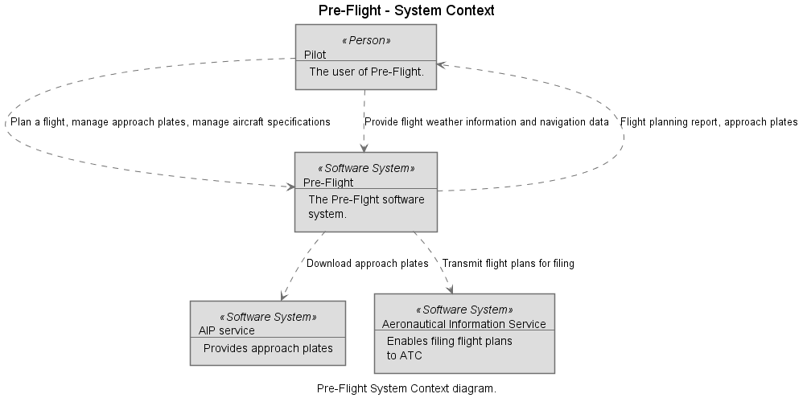
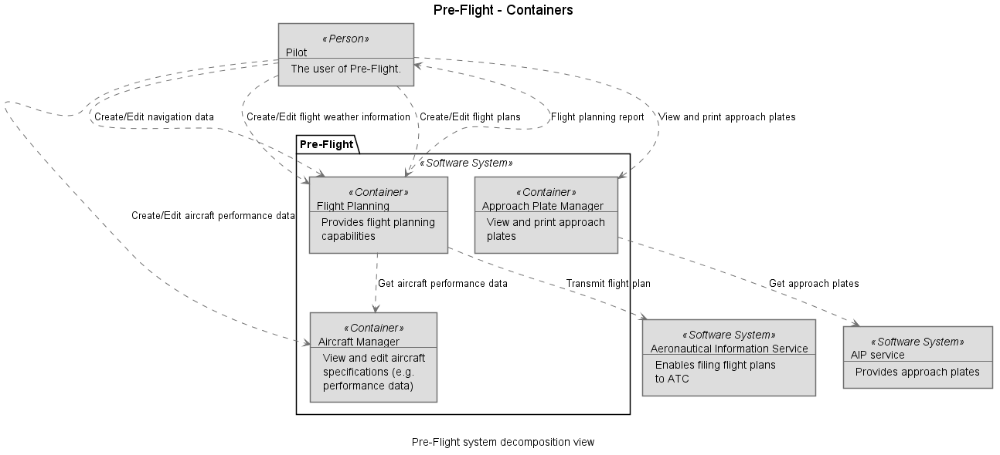

# Pre-Flight Architecture Documentation

## 1. Requirements and Goals

The goal of _pre-flight_ is:

* Open source reference architecture clearly documenting all interfaces between flight planning tools and external services, such as weather providers
* Open source tools that can be used to educate people on the functionality of each one of the tools around the flight planning that have been implemented
* Supporting pilots like me in planning VFR and IFR flights correctly and efficiently in a semi-automated manner

From this, the need to support the following quality goals arises:

* Correctness: Especially critical computations must be 100 % correct. All software will be tested with appropriate testing techniques, tests will also be published along with the software.
* Transparency: All computations will be done in a way that the user sees what is happening. For instance, the exact data sources will be mentioned by the software. This is also complementing the open source character of the software.
* Maintainability, Portability and Extensibility: The software will be designed in a way that parts can be easily exchanged and deployed elsewhere.

At a high level, features of the software will include:

1. Planning a flight route in a semi-automated manner using a paper map considering aircraft performance and the weather along the route
1. Managing printouts of approach plates needed for a flight (esp. IFR)
1. Weight and balance computations for airplanes
1. Computing the take off and landing run
1. Creating a weather briefing
1. Planning a flight route in a semi-automated manner using a list of points considering aircraft performance and the weather along the route
1. Route discovery between airports
1. Generating flight plans for filing

## 2. Constraints and Conventions

* The software must be shippable in a first version by end of 2019, this restricts the project capacity to 12 person days
* All tools included must be non-commercial and non-GPL
* All software deliverables produced by the project must be deployable on a web application server (e.g. Apache Tomcat)

## 3. System Context

## 4. Solution Strategy

* Creation of a reference architecture for flight planning tools
* Implementing the tools for automating the most time-consuming activities in the manual flight planning process
* Tools are implemented as web-apps that are accessible from any system relying only on a web browser
* Full transparency on actions performed and data used by the software to the user so that errors (e.g. invalid / outdated data) can be easily detected
* Modularization of the software in a way that leaves extension points for further automation (e.g. easy replacement of initially manual inputs by data from web services)

## 5. System Decomposition View

## 6. Runtime View

TBD

## 7. Deployment View

TBD

## 8. Cross-Cutting Concepts

TBD

## 9. Architecture Decision Log

TBD

## 10. Limitations and Technical Debt

TBD